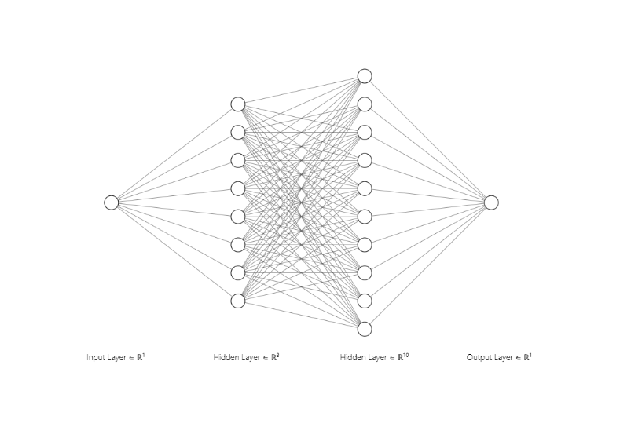
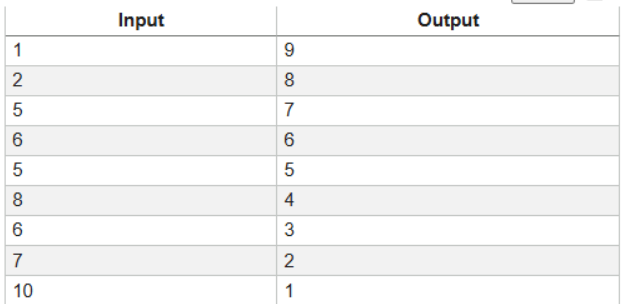
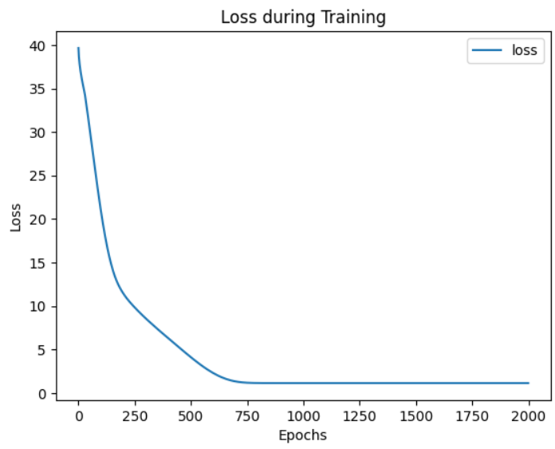
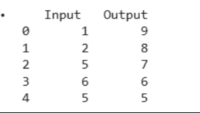
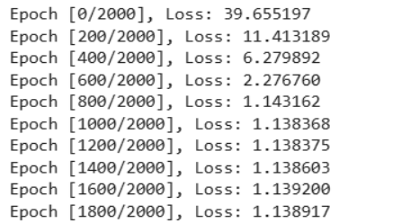

# Developing a Neural Network Regression Model

## AIM
To develop a neural network regression model for the given dataset.

## THEORY
Explain the problem statement

## Neural Network Model



## DESIGN STEPS
### STEP 1: 

Create your dataset in a Google sheet with one numeric input and one numeric output.

### STEP 2: 

Split the dataset into training and testing

### STEP 3: 

Create MinMaxScalar objects ,fit the model and transform the data.

### STEP 4: 

Build the Neural Network Model and compile the model.

### STEP 5: 

Train the model with the training data.

### STEP 6: 

Plot the performance plot

### STEP 7: 

Evaluate the model with the testing data.

### STEP 8: 

Use the trained model to predict  for a new input value .

## PROGRAM

### Name: NARENDHIRAN P

### Register Number: 212224230177

```python
class NeuralNet(nn.Module):
  def __init__(self):
        super().__init__()
        # Include your code here
        self.fc1 = nn.Linear(1,8)
        self.fc2 = nn.Linear(8,10)
        self.fc3 = nn.Linear(10,1)
        self.relu = nn.ReLU()
        self.history = {'loss':[]}
  def forward(self,x):
        x = self.relu(self.fc1(x))
        x = self.relu(self.fc2(x))
        x = self.fc3(x)
        return x


# Initialize the Model, Loss Function, and Optimizer


def train_model(ai_brain, X_train, y_train, criterion, optimizer, epochs=2000):
    # Write your code here
    for epoch in range(epochs):
      optimizer.zero_grad()
      loss = criterion(ai_brain(X_train),y_train)
      loss.backward()
      optimizer.step()

      ai_brain.history['loss'].append(loss.item())
      if epoch % 200 == 0:
          print(f'Epoch [{epoch}/{epochs}], Loss: {loss.item():.6f}')
    

```

### Dataset Information



### OUTPUT

### Training Loss Vs Iteration Plot



### New Sample Data Prediction






## RESULT
Thus, a neural network regression model was successfully developed and trained using PyTorch.
